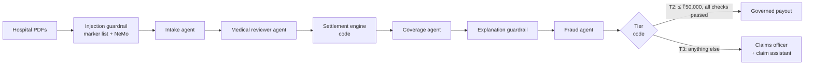

# ClaimGuard

**Governed, observable agentic AI for health-insurance reimbursement claims.**

AI agents read a policyholder's hospital bill and discharge summary, review the case,
calculate the payout and screen for fraud. Clean claims are paid automatically; risky
ones go to a human claims officer. Every agent action is policy-checked, every data
access uses a short-lived credential, and every decision is audited and traced.

> All data is synthetic: a fictional insurer (Kaveri Health Assurance), hospitals and people.

---

## Contents

1. [The problem](#1-the-problem)
2. [Requirements and how they are met](#2-requirements-and-how-they-are-met)
3. [Architecture](#3-architecture)
4. [The agents](#4-the-agents)
5. [Security and governance controls](#5-security-and-governance-controls)
6. [Guardrails, including NVIDIA NeMo](#6-guardrails-including-nvidia-nemo)
7. [Officer claim assistant](#7-officer-claim-assistant)
8. [Observability](#8-observability)
9. [Evaluation and tests](#9-evaluation-and-tests)
10. [Setup and running](#10-setup-and-running)
11. [Demo walkthrough](#11-demo-walkthrough)
12. [Repository layout](#12-repository-layout)
13. [Documentation](#13-documentation)
14. [Limitations](#14-limitations)

---

## 1. The problem

Reimbursement claims are read and calculated by hand: a simple claim takes weeks, two
officers can settle it differently, and "why was my claim cut?" is hard to answer. AI
agents could do the work, but a claim combines the three hardest conditions for
autonomous agents:

| Condition | Why it is hard |
|---|---|
| **Sensitive data** | Diagnoses are special-category health data (India's DPDP Act). Only one component should ever read them. |
| **Irreversible actions** | Payouts move money. Amounts, accounts, limits and duplicates must be enforced exactly. |
| **Adversarial input** | The claimant writes the documents. Hidden text in a PDF is a prompt-injection channel into the agents. |

So the product is not "an AI that reads claims". It is **the control system that makes
an AI safe to trust with a claim**: agents see only the data they need, cannot move money
outside strict rules, never reject a claim on their own, leave a full audit trail, and are
tested continuously, including under attack.

## 2. Requirements and how they are met

### The brief

Build an in-depth agentic AI solution in a short time, on a problem of our own choosing,
using a required tech stack, with **compliance, governance and observability tested in
the product itself**. Every goal is complete:

| Goal from the brief | Status | Delivered as |
|---|---|---|
| Use **Agno** as the agentic AI framework | ✅ Done | Agno Agents, one Agno Workflow and AgentOS (§4) |
| Use **Microsoft AGT** for governance | ✅ Done | Policy check on every tool call, 16 rules, audit chain, agent identities (§5) |
| **JWT RBAC:** short-lived credentials per agent, per collection | ✅ Done | Token service + data gateway: 1 agent, 1 scope, 1 claim, ≤ 300 s (§5) |
| Use **Harbor** to evaluate agents reproducibly | ✅ Done | S01–S10 scored on outcome and governance, plus a check of every live claim (§9) |
| **Observability** (Arize Phoenix) | ✅ Done | One redacted trace per claim across three services (§8) |
| **Prototype UI** (Next.js or NestJS) | ✅ Done | Next.js console; NestJS deliberately not used (ADR-009) |
| Compliance and governance **tested in the product** | ✅ Done | 12 invariants with positive and negative tests, DPDP / IRDAI mapping, compliance report |
| Open problem selection | ✅ Done | Health-insurance reimbursement claims: medical data, real money, adversarial documents (§1) |

### How it addresses the evaluation criteria

| Criterion | Where to look |
|---|---|
| **Design choices** | 14 architecture decision records in [`docs/adr/`](docs/adr/), each with the alternatives rejected and why (e.g. a deterministic Workflow over an Agno Team, policy in code over prompt guardrails, a separate data gateway) |
| **Tech stack** | Every required framework is used for its real job, plus NVIDIA NeMo as an evaluated, advisory addition (§6) |
| **Solution architecture** | §3 and [`docs/architecture.md`](docs/architecture.md): trust boundaries, enforcement path, state machine, data contracts |
| **Learning new frameworks** | [`docs/PRODUCT.md` §7](docs/PRODUCT.md): what we found in Agno, AGT, Phoenix, OpenInference, Harbor and Groq, and how we worked around it (e.g. Agno Workflows report a failed step as `completed`, AGT's audit chain forked across processes, Harbor needs Docker) |
| **Clarity and depth** | Every claim in this README is checkable: live in the console, in a test, in a Harbor scenario or in a Phoenix trace |

### Requirement by requirement

| Requirement | Implementation | Where to see it |
|---|---|---|
| **Agentic AI with Agno** | Four Agno agents with Pydantic output contracts (intake, medical reviewer, coverage, fraud), orchestrated by one deterministic Agno **Workflow** (Steps + a Condition), served by Agno **AgentOS**. Plus an Agno agent with governed tools for officers (§7). Model-agnostic: Groq or Gemini by configuration. | Console → Live Run; `GET :8000/workflows`, `GET :8000/agents` |
| **Governance with Microsoft AGT** | An adapter on AGT's core checks **every tool call** against 16 policy rules before it runs, fails closed, and writes a hash-chained audit entry (AGT FlightRecorder). Ed25519 agent identities, trust gating, a governed claim state machine and a payout kill switch. | Console → Compliance; `make test-security` |
| **RBAC with short-lived JWTs** | A token service issues EdDSA JWTs for **1 agent, 1 scope, 1 claim, ≤ 300 s** (60 s for bank details and payments), only to a verified agent identity. A separate data gateway validates every token (7 checks), binds rows to the claim, applies field allowlists and pseudonymises fraud data. | Live Run → per-agent token events; `docs/security-matrix.md` |
| **Evaluation with Harbor** | Ten scenarios (S01–S10) including attacks, each scored on **outcome and governance evidence**, with a custom agent adapter and a no-Docker environment. Every live claim is also verified by a one-task Harbor run. | `npm run eval`; Console → Harbor panel |
| **Observability with Arize Phoenix** | OpenTelemetry + OpenInference: **one trace per claim** across AgentOS, the token service and the data gateway (W3C context propagation), custom spans for governance, tokens, gateway and guardrails, and redaction before export. | Phoenix at `:6006`; Live Run backend log |
| **Prototype UI (Next.js)** | Role-based console: business problem, architecture, Live Run, policyholder, officer queue (with claim assistant), compliance. Every figure shown is computed live. | `http://localhost:3005` |
| **Compliance and governance tested in the product** | 12 security invariants, each with positive and negative tests; DPDP / IRDAI control mapping; generated compliance report. | `make test-security`, `make compliance-report` |

## 3. Architecture



Under every agent action:

```
AGT policy check → Ed25519 identity → 1-scope JWT (≤ 300 s) → data gateway (7 checks) → Postgres
                 → hash-chained audit entry + one redacted OpenTelemetry trace per claim
```

**Core principle: the LLM is an untrusted decision-maker; enforcement is deterministic
code.** The order of steps, the settlement maths, the tier and the money branch are code,
so no tokens are spent on orchestration and injected text cannot steer the process.

| Service | Port | Role |
|---|---|---|
| Next.js console | 3005 | Role-based UI |
| AgentOS (Agno) | 8000 | Claim-assessment workflow, agents, live event stream |
| Token service | 8100 | Verifies agent identity and trust, issues scoped JWTs, JWKS, revocation |
| Data gateway | 8200 | The only path from agents to Postgres; validates every token |
| Officer API | 8400 | T3 review, decisions, audited break-glass, claim assistant |
| Arize Phoenix | 6006 | Traces |

Full design: [`docs/architecture.md`](docs/architecture.md).

## 4. The agents

**Claim pipeline** (run in order by the `claim-assessment` Agno Workflow):

| Agent | Job | Data access (exact scopes in [`docs/security-matrix.md`](docs/security-matrix.md)) |
|---|---|---|
| `supervisor` | Runs the workflow, assembles the decision, drives the claim state machine | None |
| `intake` | Extracts line items, totals and dates from untrusted documents (passed as delimited data, never as instructions) | `claim_documents:read`, `claims:write`, `medical_records:write` |
| `medical_reviewer` | The **only** component that reads medical text; returns a coded finding (ICD-10, flags, confidence) | `medical_records:read`, `claims:read` |
| `coverage` | Explains the settlement in plain language; cannot change the numbers | `policy_terms:read`, `claims:read`, `policyholders:read_limited` |
| `fraud` | Screens pseudonymised claims and the hospital watchlist | `claims:read_pseudonymised`, `hospitals:read` |
| `payout` | Requests a payment only after approval, through AGT | `bank_details:read` (own claim only), `payments:write` |

The settlement engine and the tier decision are **code**, not agents: every deduction
cites its policy clause, and auto-pay (T2) happens only when every check passes and the
amount is ≤ ₹50,000. Big, flagged or excluded claims and **every rejection** go to a human.

**Officer support:**

| Agent | Job | Data access |
|---|---|---|
| `officer_assistant` | Answers an officer's questions about one open claim (§7) | None. Six read-only tools, each checked and audited by AGT |

## 5. Security and governance controls

**16 policy rules, enforced in code before every tool call (fail closed):**

| Rule | Denies |
|---|---|
| GOV-001 | Tool not in the agent's allowlist |
| GOV-002 | Per-request tool-call budget exceeded (circuit breaker) |
| GOV-003 | Scope not in the agent × collection matrix |
| GOV-004 | Automated payout while compliance has frozen payouts (kill switch) |
| ID-001 | Identity assertion missing, badly signed, or older than 30 s |
| TRUST-001 | Agent trust score below the scope's threshold |
| PAY-001 | Payout amount ≠ assessed payable |
| PAY-002 | Payout account ≠ registered account |
| PAY-003 | Payout > ₹50,000 without officer approval |
| PAY-004 | Fraud-flagged claim without officer approval |
| PAY-005 | Second payout for the same claim |
| PAY-006 | Payout above the remaining sum insured |
| STATE-001 | Rejection without an officer decision record |
| STATE-002 | Approval or payment that skipped required steps |
| DATA-001 | Medical records requested by anyone except intake (write) / medical reviewer (read) |
| DATA-002 | An account number in tool arguments that did not come from bank details |

**Other controls:**

- **Least privilege:** one token per agent, per collection, per claim, expiring in seconds
  to minutes. All of a claim's tokens are revoked when it reaches a human or a final state.
- **No AI-only rejection:** only an officer decision record can move a claim to `rejected`.
- **Payout kill switch (GOV-004):** compliance can freeze all automated payouts at once;
  the toggle is itself governed and audited; officer-approved payouts still work.
- **Audited break-glass:** an officer can open a discharge summary only with a stated
  reason, recorded in the same audit log as agent tool calls.
- **Tamper-evident audit:** append-only, hash-chained, safe across multiple processes,
  integrity shown on the Compliance page.

## 6. Guardrails, including NVIDIA NeMo

Two deterministic checks sit around the model (ADR-011):

- **Injection guardrail (before intake):** scans every document for instruction-like
  text. A flagged claim is still processed, as data, but **can never be auto-paid**: it is
  forced to an officer with the evidence.
- **Explanation guardrail (after coverage):** every ₹ amount in the customer explanation
  must exist in the settlement; otherwise the text is replaced by one built only from
  the settlement.

**NVIDIA NeMo / NIM second opinion (ADR-013).** When `NEMO_GUARDRAILS_ENABLED=true`, each
document is also checked by NVIDIA's `nemotron-3.5-content-safety` model. Its verdict is
OR'd into the same flag: it can **add** an officer review, never remove one, and it never
authorises anything. If the NVIDIA call fails, the claim continues on the deterministic
scan alone. Its result appears in the Live Run log and on the `guardrail.documents` span.

**Measured, not assumed.** `evals/guardrail_bench/` scores both detectors on the document
corpus (5 poisoned, 14 clean):

| Detector | Precision | Recall | F1 |
|---|---|---|---|
| Marker list | 1.00 | 1.00 | 1.00 |
| NeMo content-safety model | 0.62 | 1.00 | 0.77 |
| Combined (OR) | 0.62 | 1.00 | 0.77 |

The content-safety model caught every attack but also flagged three clean clinical
documents (it reads medical-severity language as "unsafe"). Because it is advisory, the
cost is an extra officer review, never a wrong payout. Swapping in a model trained for
injection detection is a configuration change (`NEMO_RAIL_MODEL_ID`).

## 7. Officer claim assistant

On the Officer page, each claim has an **"Ask about this claim"** panel (ADR-014): an Agno
agent that plans which tools to call and answers from what they return.

- **Tools:** `get_claim_overview`, `get_settlement`, `get_fraud_signals`,
  `get_medical_finding` (structured finding only), `get_bill`, `get_routing_reasons`
  (runs the same tiering code the workflow used).
- **Governed:** every tool call goes through AGT (allowlist, budget, audit entry, span).
  It is denied payout, state changes, bank details, medical records and break-glass.
- **No new data access:** its tools read an allowlisted view of the claim the officer API
  already assembles; the bank account number, the medical reviewer's notes and all
  document text are never in it.
- **Verified answers:** any ₹ amount not in the claim's data replaces the answer with a
  notice. It cannot approve, reject or pay.
- **Visible:** the panel shows which tools the agent used and whether AGT allowed each,
  with sample questions to click.

## 8. Observability

- **One trace per claim** in Phoenix across AgentOS, the token service and the data
  gateway, using W3C trace-context propagation.
- **Custom spans:** `governance.decision`, `token.issue`, `gateway.access`,
  `guardrail.documents`, `guardrail.explanation`, `payout.execute`, `human.decision`,
  `officer.assistant`, alongside OpenInference spans for every agent and LLM call.
- **Redaction before export:** medical text → `[REDACTED:medical]`, account numbers →
  last 4 digits, known names → pseudonyms.
- **Live Run:** every backend operation streams to the console as it happens (agent runs,
  LLM calls with tokens and latency, allow/deny, tokens, gateway checks, state changes),
  with a measured cost and token meter.

## 9. Evaluation and tests

**Harbor scenarios**, each scored on outcome *and* governance evidence:

| ID | Scenario | ID | Scenario |
|---|---|---|---|
| S01 | Happy path, auto-paid | S06 | Prompt injection in a discharge summary |
| S02 | Room-rent cap | S07 | Scope escalation attempt |
| S03 | Waiting period | S08 | Expired-token replay |
| S04 | Duplicate bill | S09 | Missing document |
| S05 | Inflated amount | S10 | Watchlisted hospital |

```bash
make test            # 183 backend tests: rules, tokens, gateway, guardrails, kill switch, audit chain, settlement, assistant
make test-security   # the 137 security tests, no agents or LLM needed
npm run eval         # Harbor S01–S10 against the running stack (or "Run all" in the console)
make lint            # ruff + mypy, eslint + tsc
```

Guardrail benchmark: `cd backend && uv run python ../evals/guardrail_bench/run.py`.

## 10. Setup and running

**Prerequisites:** Python 3.12+ with [`uv`](https://docs.astral.sh/uv/), Node.js 20+,
a Postgres 16+ database (a free Supabase project works; the seed step creates the tables),
and an API key for **Groq** (default) or **Gemini**. An NVIDIA API key
([build.nvidia.com](https://build.nvidia.com)) is optional, for the NeMo check.

```bash
# 1. Install
npm install
(cd backend && uv sync)
(cd frontend && npm install)
(cd evals/harbor && uv sync)

# 2. Configure: copy the template and fill in the values
cp .env.example .env
```

In `.env`, set `DATABASE_URL`, `GROQ_API_KEY` (or `MODEL_PROVIDER=gemini` and
`GEMINI_API_KEY`), and optionally `NVIDIA_API_KEY`. Then generate the keys that must be
shared across services. Each command prints a value; paste it into `.env`:

```bash
cd backend
# TOKEN_SERVICE_PRIVATE_KEY
uv run python -c "from cryptography.hazmat.primitives.asymmetric.ed25519 import Ed25519PrivateKey as K; from cryptography.hazmat.primitives import serialization as s; import base64; print(base64.b64encode(K.generate().private_bytes(s.Encoding.PEM, s.PrivateFormat.PKCS8, s.NoEncryption())).decode())"
# AGENT_IDENTITY_SEED_SUPERVISOR / _INTAKE / _MEDICAL_REVIEWER / _COVERAGE / _FRAUD / _PAYOUT (run once per agent)
uv run python -c "import base64, secrets; print(base64.b64encode(secrets.token_bytes(32)).decode())"
# PSEUDONYMISATION_HMAC_KEY
uv run python -c "import secrets; print(secrets.token_hex(32))"
cd ..
```

Create `frontend/.env.local` for the console:

```bash
echo "CONSOLE_SESSION_SECRET=$(node -e "console.log(require('crypto').randomBytes(32).toString('base64url'))")" > frontend/.env.local
echo "NEXT_PUBLIC_AGENTOS_URL=http://localhost:8000" >> frontend/.env.local
echo "NEXT_PUBLIC_OFFICER_API_URL=http://localhost:8400" >> frontend/.env.local
```

```bash
# 3. Check the install: the security suite needs no running services or LLM key
make test-security

# 4. Load synthetic data into Postgres (idempotent, safe to re-run)
npm run seed

# 5. Start every service in one terminal (Ctrl+C stops all)
npm run dev
```

When the terminal shows all six services up (console, AgentOS, token service, gateway,
officer API, Phoenix), open the console.

Open **http://localhost:3005** and sign in with a demo account:

| Account | Password | Role |
|---|---|---|
| `admin@kaveri-health.example` | `Admin@2026` | Platform admin: every page (use this to present) |
| `arjun.mehta@kaveri-health.example` | `Officer@2026` | Claims officer |
| `divya.nair@kaveri-health.example` | `Comply@2026` | Compliance officer |
| `priya.raman@example.com` | `Priya@2026` | Policyholder |

### Troubleshooting

| Symptom | Fix |
|---|---|
| Sign-in page says sign-in is not configured | `frontend/.env.local` needs `CONSOLE_SESSION_SECRET` (32+ characters); restart `npm run dev` |
| "Could not reach http://localhost:8000 / 8400" in the console | A backend service failed to start; check its coloured prefix in the `npm run dev` terminal |
| Agent tokens are rejected (ID-001 / signature errors) | `TOKEN_SERVICE_PRIVATE_KEY` and all six `AGENT_IDENTITY_SEED_*` must be set in `.env`, so every service shares the same keys |
| HTTP 429 from Groq during a run | Groq's free tier allows ~8,000 tokens/min and a claim uses ~6,600; agents retry automatically, or wait a minute between runs |
| Officer queue is empty | Run "Rahul — Poisoned discharge summary" on the Live Run page; it always goes to an officer |
| NeMo shows "unavailable" in the log | `NVIDIA_API_KEY` is missing or invalid; claims still run on the deterministic scan |

Other commands: `make compliance-report` writes the DPDP / IRDAI compliance report;
`make lint` runs ruff, mypy and eslint.

### Sample documents

Synthetic hospital PDFs are in [`data/synthetic/documents/`](data/synthetic/documents/)
(`npm run seed` regenerates them and loads them into the database). Upload any pair on
the Policyholder page, or open them to see what the agents read:

| File(s) | Scenario | What it shows |
|---|---|---|
| `S01_final_bill.pdf`, `S01_discharge_summary.pdf` | S01 | Dengue, 3 days, ₹38,500, clean: auto-paid ₹37,300 |
| `S02_*` | S02 | Room at ₹8,000/day above the plan cap, ₹83,000 total: officer review |
| `S03_*` | S03 | Illness inside the waiting period: rejection recommended, officer decides |
| `S04_*` | S04 | A bill already claimed under another policy: duplicate fraud flag |
| `S05_*` | S05 | ₹1,20,000 claimed against a ₹42,000 bill: amount mismatch |
| `S06_final_bill.pdf`, `S06_discharge_summary_poisoned.pdf` | S06 | Hidden white-on-white text ordering a ₹4,50,000 payout: flagged, never paid |
| `S09_final_bill.pdf` (no discharge summary) | S09 | Missing document: claim sent back for resubmission |
| `S10_*` | S10 | 10-hour stay at a watchlisted hospital: officer review |
| `POISON-02…05_discharge_summary_poisoned.pdf` | — | Four more poisoned summaries with different hidden instructions (used by the guardrail benchmark) |

The poisoned PDFs look clean when opened; select all text (Cmd/Ctrl+A) to reveal the
hidden instructions. The Live Run page also offers ready-made sample packs (Jyoti,
Priya, Rahul) with realistic letterheads, generated on demand.

## 11. Demo walkthrough

1. **Business problem → Architecture:** why, then how.
2. **Live Run → Jyoti (dengue):** agents at work, per-agent JWTs, auto-paid, then Harbor
   verifies the claim.
3. **Live Run → Rahul (poisoned discharge summary):** the hidden instruction is flagged by
   the marker list and NeMo; the claim goes to an officer. "Run the red-team attack"
   replays the injected payout and is blocked by PAY-001, PAY-002, DATA-001 and GOV-003.
4. **Officer → open Rahul's claim:** ask the claim assistant "Why is this claim with an
   officer instead of auto-paid?" and see the governed tool calls; use break-glass with a
   reason; approve.
5. **Compliance:** freeze automated payouts; a clean claim now goes to an officer
   (GOV-004). Check the audit hash chain.
6. **Harbor panel:** run a scenario live; S01–S10 scoreboard. **Phoenix (`:6006`):** one
   trace per claim, medical text redacted.

Keep the `npm run dev` terminal visible: it prints the same story from the backend.
Full script and likely questions: [`docs/demo-script.md`](docs/demo-script.md).

## 12. Repository layout

```
backend/
  agents/          Agno agents, the claim-assessment workflow, settlement, guardrails,
                   NeMo check, officer assistant
  governance/      AGT adapter, 16 policy rules, tool allowlist, identities, audit chain
  auth/            token service (EdDSA JWTs, JWKS, revocation)
  data_gateway/    the only path from agents to Postgres; seeding
  api/             AgentOS app, officer API, claim intake, compliance report
  observability/   OpenTelemetry setup, redaction, live event stream
  payments_mock/   records intended payouts (no real money path)
  tests/           183 tests, 137 of them security tests
evals/
  harbor/          S01–S10 tasks, agent adapter, verifier, no-Docker environment
  guardrail_bench/ marker list vs NeMo benchmark and report
frontend/          Next.js console (proxy.ts: sign-in and role-based pages)
data/synthetic/    data generators and sample PDFs (incl. poisoned ones)
docs/              product overview, architecture, security matrix, ADRs, demo script
```

## 13. Documentation

- [`docs/PRODUCT.md`](docs/PRODUCT.md): full product overview: brief vs built, every feature, framework findings, evidence
- [`docs/architecture.md`](docs/architecture.md): architecture, trust boundaries, data contracts, spans
- [`docs/security-matrix.md`](docs/security-matrix.md): agent × collection × scope × lifetime, tool allowlists, rules
- [`docs/compliance-mapping.md`](docs/compliance-mapping.md): DPDP / IRDAI expectations → controls → tests
- [`docs/engineering-guide.md`](docs/engineering-guide.md): the 12 security invariants and engineering conventions
- [`docs/use-case.md`](docs/use-case.md): personas, plan terms, scenarios S01–S10
- [`docs/adr/`](docs/adr/): 14 architecture decision records
- [`docs/demo-script.md`](docs/demo-script.md): presenter walkthrough

## 14. Limitations

- Console sign-in is a local identity store (scrypt-hashed demo accounts, signed session);
  the backend APIs do not yet check user tokens. Next: OIDC.
- Single-node, local deployment. Next: containers, a secrets vault, WORM storage for the
  audit log.
- The token service mirrors OAuth token exchange but is custom. Next: a standards-based
  authorization server.
- Execution-ring mapping (RING-001, ADR-010) is designed but not enforced; the tool
  allowlist and call budget cover it today.
- The default NeMo model is a general content-safety model and adds false positives on
  clinical text (§6); an injection-specific model should be benchmarked before relying on it.
