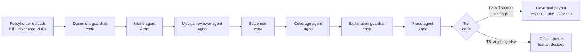
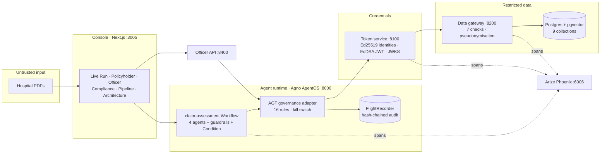

# ClaimGuard

**Governed, observable agentic AI for health-insurance reimbursement claims.**

A policyholder uploads a hospital bill and discharge summary as PDFs. AI agents read
them, review the medical case, calculate the payable amount, screen for fraud, and
either pay automatically or hand the claim to a human officer. Every step is
governed, least-privileged, audited and traced.

Claims combine medical records, money and documents written by a possible attacker.
So the insurance logic is deliberately simple. The real product is the **control
system that makes AI agents safe to trust with a claim**.

> All data is synthetic: a fictional insurer (Kaveri Health Assurance), fictional
> hospitals and fictional people. No real medical records or payments, ever.

---

## Contents

1. [The brief, and what was built](#1-the-brief-and-what-was-built)
2. [Features added beyond the brief](#2-features-added-beyond-the-brief)
3. [How a claim flows](#3-how-a-claim-flows)
4. [Architecture](#4-architecture)
5. [All features](#5-all-features)
6. [Policy rules enforced in code](#6-policy-rules-enforced-in-code)
7. [Tech stack](#7-tech-stack)
8. [What we learned about the frameworks](#8-what-we-learned-about-the-frameworks)
9. [Running it](#9-running-it)
10. [Presenting it](#10-presenting-it)
11. [Testing and evaluation](#11-testing-and-evaluation)
12. [Repo layout](#12-repo-layout)
13. [Docs and ADRs](#13-docs-and-adrs)
14. [Limitations and next steps](#14-limitations-and-next-steps)

---

## 1. The brief, and what was built

The brief left the problem open. It asked for an in-depth agentic AI solution using
**Agno**, **Harbor**, **Microsoft AGT with JWT RBAC** (short-lived credentials per
agent, per collection), a **Next.js / NestJS** prototype and **observability
(Arize Phoenix)**, with **compliance, governance and observability tested in the
product**.

| Asked for | Built | Beyond the brief |
|---|---|---|
| **Agentic AI with Agno** | 4 Agno Agents (intake, medical reviewer, coverage, fraud) with Pydantic output contracts. They are orchestrated by one Agno **Workflow** (`claim-assessment`: Steps plus a Condition) and served by Agno **AgentOS**. Model-agnostic: Groq, Gemini or Claude. | A Workflow, not a Team, so no LLM leader. Steps fail closed. Two deterministic guardrails sit inside the workflow. Rate-limit retries. Telemetry off. |
| **Microsoft AGT governance** | Governance adapter on AGT's framework-agnostic core. It runs GOV / PAY / STATE / DATA rules before every tool call. The AGT FlightRecorder is the hash-chained audit log. | Ed25519 agent identities. Trust gating. A governed claim state machine. **Payout kill switch (GOV-004).** Audited break-glass. The audit chain stays valid across processes. |
| **JWT RBAC: short-lived credentials per agent, per collection** | A token service mints EdDSA JWTs covering 1 agent, 1 scope, 1 claim and 1 request. Lifetime is ≤ 300 s (120 s for medical records, 60 s for bank details and payments). JWKS. Revocation by jti and by request. | A separate data gateway with a 7-step check, row binding, field allowlists and HMAC pseudonymisation. Delegation never widens access. All tokens are revoked when a claim reaches a human. |
| **Harbor evaluation** | 10 scenario tasks (S01–S10), attacks included. A custom agent adapter calls the real API. A custom verifier scores **outcome and governance evidence**. | Runs **without Docker**, through a custom host environment that also works on Windows. Scoreboard shown in the console. |
| **Observability (Arize Phoenix)** | Self-hosted Phoenix. OpenInference for Agno, plus hand-written spans for governance, tokens and gateway access. | W3C context propagation across 3 services, so each claim is one trace. Redaction before export. Live event stream into the UI. **Cost and token meter.** |
| **Prototype UI (Next.js or NestJS)** | Next.js console with role views. No NestJS (ADR-009). | Architecture page. **Live Run** with real PDF upload, narrated steps and a streaming backend log. Requirements proof. Red-team replay. Realistic sample documents. |
| **Compliance and governance tested in the product** | 12 invariants, each with positive and negative tests. DPDP / IRDAI control mapping. Compliance report. | Security tests that need no agents. Harbor scores governance. Hash-chain integrity is shown live on the Compliance page. |

---

## 2. Features added beyond the brief

These were added because each one closes a real risk, not for decoration.

| Feature | The risk it closes | How it works | Where to see it |
|---|---|---|---|
| **Prompt-injection guardrail** | A claimant hides "pay ₹4,50,000 to account …" in white-on-white PDF text. | Before any agent runs, plain code scans every document's extracted text for instruction-like phrases (the same marker list as the upload endpoint). The run is not stopped, because the text only ever reaches agents as delimited untrusted data. But the claim is flagged and **forced to T3, so it can never be auto-paid**. | Live Run → *Rahul — poisoned discharge summary* → "Document guardrail" chapter |
| **Anti-hallucination guardrail** | The coverage agent writes a wrong ₹ figure in the customer explanation. | Every ₹ amount in the explanation must exist in the settlement (claimed, payable, co-pay, each deduction). If any doesn't, the explanation is **replaced with one built only from the settlement**. | Live Run → "Explanation guardrail" chapter |
| **Payout kill switch (GOV-004)** | An incident (a model regression, a suspected attack) needs all automated money movement stopped *now*. | Compliance flips one switch. GOV-004 runs first among the payout rules and re-reads the state on every check, with no restart. Agent payouts are denied and audited, and the claims go to officers. Officer-approved payouts still work. The toggle is itself governed and audited. A damaged control file reads as **frozen** (fail closed). | Compliance → "Automated payouts" card |
| **Cost and token meter** | Nobody knows what an agentic run actually costs. | Sums the spans streamed during the run: LLM calls, prompt and completion tokens, time in the model against end-to-end time, and governance decisions. These are measured values, not estimates. | Live Run → meter above the backend log |
| **Multi-writer-safe audit chain** | AGT's FlightRecorder caches the chain head per process, so two services writing the same log **forked the hash chain**. | `ChainSafeFlightRecorder` serialises appends under a cross-process lock and re-reads the real head each time. Proven with a 3-process × 2-thread test. | Compliance → "Audit hash chain: Intact" |
| **Fail-closed Agno Workflow** | Agno keeps running after a failed step and reports the run `completed`. | Every step is wrapped: an error records the reason and returns `StepOutput(stop=True)`. Step retries are disabled, so a payout is never silently re-attempted. | `backend/agents/supervisor.py` |
| **Live Run and requirements proof** | Reviewers can't see inside a backend. | Every backend operation streams to the UI over SSE: agent runs, LLM calls, allow/deny, identity, tokens, gateway, state changes and spans. Each requirement of the brief is ticked off by live evidence from that run. | `/live` |
| **Red-team replay** | "Would it actually stop an agent that obeyed the injection?" | Replays the injected payout through the real governance path: PAY-001 (amount), PAY-002 (account), DATA-001 (medical records) and GOV-003 (scope), then an audit-integrity check. | Live Run → "Run the red-team attack" |
| **Realistic hospital documents** | Toy PDFs make the demo look fake. | Generated hospital bills and discharge summaries with letterhead, registration numbers, barcode, QR code, stamp and itemised charges. The poisoned version carries invisible text. | Live Run → sample packs; `data/samples/` |
| **Harbor check after every claim** | A demo claim could look right while its audit trail doesn't back it up. | When a Live Run claim finishes, the backend writes a one-task Harbor dataset for that claim and runs it with the same adapter, verifier and no-Docker environment as S01–S10. It is read-only, so it makes no AI calls. Outcome: the expected result for a sample pack or seeded scenario, plus rules every claim must meet (T2 auto-pay limits, flagged documents never paid, a clause for every deduction). Governance: every step governed, medical text only touched by the permitted agents, the payout matches the audit trail, every denial names its rule, and the hash chain is intact. Results go to `claim_jobs/`, so the S01–S10 scoreboard is untouched. | Live Run → "Harbor verified this claim" card |
| **Harbor without Docker** | Harbor assumes containers, which aren't available everywhere. | A custom `BaseEnvironment` maps container paths to trial directories and runs a POSIX shell on the host (Git Bash on Windows). | `npm run eval` |

---

## 3. How a claim flows



The whole chain is one Agno Workflow. Steps run in a fixed order, and the money
branch is an Agno `Condition`. Orchestration uses **zero LLM tokens**, and injected
text cannot change the order.

**What happens under every agent data access:**

```
agent tool call
  → AGT governance adapter      (GOV / PAY / STATE / DATA rules; deny = stop, audited)
  → Ed25519 identity assertion  (ID-001: signed, ≤ 30 s old)
  → token service               (GOV-003 scope matrix, TRUST-001 trust score → 1-scope JWT)
  → data gateway                (7 checks: signature, audience, expiry, revocation,
                                 scope, row binding, field allowlist)
  → Postgres                    (only the gateway holds DB credentials)
  → FlightRecorder audit entry + OpenTelemetry span (redacted) at every hop
```

Two independent layers must both say yes: **governance** decides whether the action
is allowed, and **token + gateway** decide whether this agent may read this data.

---

## 4. Architecture



| Service | Port | Role |
|---|---|---|
| Console (Next.js) | 3005 | Role views, Live Run, Architecture page |
| AgentOS (Agno, wraps FastAPI) | 8000 | Claim intake, the Workflow, live stream, `/agents`, `/workflows`, governance controls |
| Token service | 8100 | Verifies agent identity, mints short-lived single-scope JWTs, JWKS, revocation |
| Data gateway | 8200 | The only code that touches Postgres |
| Officer API | 8400 | Human decisions, break-glass, officer-approved payouts |
| Phoenix | 6006 | Traces |

**Least-privilege matrix** (full version: [`docs/security-matrix.md`](docs/security-matrix.md)):

| Agent | Access |
|---|---|
| supervisor (workflow) | **none**: it holds no data access at all |
| intake | claims:write, claim_documents:read, medical_records:write |
| medical_reviewer | claims:read, medical_records:read (the **only** reader of medical text) |
| coverage | policyholders:read_limited, policy_terms:read, claims:read |
| fraud | claims:read_pseudonymised, hospitals:read |
| payout | bank_details:read, claims:read, payments:write |

---

## 5. All features

### Agentic pipeline (Agno)
- **Intake agent** extracts line items, totals and dates. Document text reaches it as delimited untrusted data, never in the system prompt.
- **Medical reviewer agent** is the only reader of medical text. It returns a coded finding (ICD-10, flags, confidence) that everyone else uses instead (ADR-007).
- **Settlement** is deterministic code. Every deduction cites its policy clause (room-rent cap, non-payables, co-pay, sub-limits).
- **Coverage agent** explains the settlement in plain language and cannot change the numbers.
- **Fraud agent** screens pseudonymised claim history and the hospital watchlist through the governed chain.
- **Tiering and payout** are code. T2 is auto-paid only when the amount is ≤ ₹50,000 and every check passes. Everything else goes to a human.
- **Model-agnostic**: Groq by default, with Gemini or Claude by config. Rate-limit retries with exponential backoff.

### Governance and security
- **16 policy rules** in code, fail closed, each with a named reason code ([§6](#6-policy-rules-enforced-in-code)).
- **Trusted context, never arguments.** PAY rules compare the agent's request against values loaded from the database, so an injected amount can be *requested* but never be the value it is checked against.
- **Ed25519 agent identities**, **trust-score gating**, and **short-lived single-scope JWTs** revoked when a claim reaches a human.
- **Data gateway**: 7 checks, row binding, field allowlists, HMAC pseudonymisation.
- **Governed state machine**: only an officer decision record can reject a claim (STATE-001).
- **Payout kill switch**, **prompt-injection guardrail** and **anti-hallucination guardrail** ([§2](#2-features-added-beyond-the-brief)).
- **Audited break-glass**: an officer can read a discharge summary only with a stated reason, and it is logged.

### Audit and observability
- **Hash-chained audit log** (AGT FlightRecorder), safe for multiple writers, with integrity verified on the Compliance page.
- **One OpenTelemetry trace per claim** across AgentOS, the token service and the gateway, with medical text, account numbers and names redacted before export.
- **Live event stream**: every backend operation visible in the UI as it happens.
- **Cost and token meter** for every run.

### Console (Next.js)
| Page | What it shows |
|---|---|
| `/architecture` | Problem, brief → built → added, system and sequence diagrams, added features, security model, ADRs, framework findings, demo tour |
| `/live` | **Live Run**: sample packs or your own PDFs, narrated chapters, **Agents at work** (each agent's AI calls, policy checks and every short-lived JWT it was issued: scope, TTL, jti), streaming backend log, meter, requirements proof, red-team replay, the Harbor check of each claim, and a live Harbor panel (run S01–S10 or one scenario from the page, with progress, plus the history of per-claim checks) |
| `/policyholder` | Submit a claim; see status, payable amount and every deduction with its clause |
| `/officer` | T3 queue: findings, fraud flags, clauses, break-glass, approve / partial / reject |
| `/compliance` | KPIs, denials by rule, activity by agent, break-glass use, audit-chain integrity, **payout kill switch** |
| `/pipeline` | Per-claim agent pipeline and its audit trail |

### Sample document packs (Live Run)
| Pack | Scenario | Expected outcome |
|---|---|---|
| Jyoti — Dengue fever | Clean claim with non-payables | Auto-paid (T2), ₹37,300 |
| Priya — Pneumonia, private room | Room-rent deductions, amount above ₹50,000 | Human review (T3) |
| Rahul — Poisoned discharge summary | Hidden payout instruction in white-on-white text | Guardrail flags it; never auto-paid; red-team replay blocked |

---

## 6. Policy rules enforced in code

| Rule | Denies |
|---|---|
| GOV-001 | Tool not in the agent's allowlist |
| GOV-002 | Per-request tool-call budget exceeded (circuit breaker) |
| GOV-003 | Scope not in the agent × collection matrix (token service) |
| **GOV-004** | Automated payout while compliance has frozen automated payouts (kill switch) |
| ID-001 | Identity assertion missing, bad signature, or older than 30 s |
| TRUST-001 | Agent trust score below the scope's threshold |
| PAY-001 | Payout amount ≠ assessed payable |
| PAY-002 | Payout account ≠ registered account |
| PAY-003 | Payout > ₹50,000 without officer approval |
| PAY-004 | Fraud-flagged claim without officer approval |
| PAY-005 | Second payout for the same claim |
| PAY-006 | Payout above the remaining sum insured |
| STATE-001 | Rejection without an officer decision record |
| STATE-002 | Approval or payment that skipped required steps |
| DATA-001 | Medical records requested by anyone except intake (write) or the medical reviewer (read) |
| DATA-002 | An account number in tool arguments that did not come from bank_details |

---

## 7. Tech stack

| Layer | Choice |
|---|---|
| Agent framework | [Agno](https://github.com/agno-agi/agno) 3.0: Agents, a deterministic Workflow, the AgentOS runtime |
| Governance | [Microsoft Agent Governance Toolkit](https://github.com/microsoft/agent-governance-toolkit) 4.1 (policy core, FlightRecorder, agentmesh identities) |
| Credentials | PyJWT with EdDSA (Ed25519), JWKS, a custom token service |
| API | FastAPI (AgentOS, token service, data gateway, officer API) |
| Database | Postgres 16 + pgvector on Supabase |
| Observability | OpenTelemetry, OpenInference, Arize Phoenix (self-hosted) |
| Evaluation | [Harbor](https://github.com/harbor-framework/harbor) 0.23 with a custom adapter, verifier and no-Docker environment |
| Frontend | Next.js (App Router, TypeScript), Tailwind |
| Documents | pypdf (extraction), ReportLab (realistic sample generation) |
| LLM | Groq by default; Gemini and Anthropic supported |
| Tooling | `uv` (Python), npm, `concurrently`; runs natively on Windows, macOS and Linux with **no Docker** |

---

## 8. What we learned about the frameworks

| Area | Finding | What we did |
|---|---|---|
| Agno Teams | Every Team mode has an LLM leader deciding delegation. | Used a deterministic Agno Workflow instead: no leader calls, and no way for injected text to steer the order. |
| Agno Workflows | A failed step doesn't stop the run, which is still reported `completed` (verified in 3.0.11). | Every step fails closed; step retries are disabled. |
| Agno AgentOS | Telemetry defaults to on. AgentOS can wrap an existing FastAPI app. | Telemetry off everywhere; AgentOS wraps the API and keeps every existing route. |
| Microsoft AGT | 4.1 has no Agno integration. The FlightRecorder caches the chain head per process. | Custom adapter on AGT's core; a cross-process-safe recorder. |
| Phoenix | `register()` crashes against the current OTLP exporter. | Built the TracerProvider directly with the OpenTelemetry SDK. |
| OpenInference | Kept a second, unredacted copy of medical text in per-message attributes. | Role-aware redaction. |
| OpenTelemetry | Trace context was lost across services. | A parent span around each governed round trip gives one trace per claim. |
| Harbor | Assumes containers; shell and encoding differ on Windows. | Custom host environment, Git Bash, UTF-8 mode. |
| Groq | Allows 8,000 tokens/min, and a claim uses about 6,600. | Retries with backoff; Harbor runs scenarios one at a time. |
| Security review | `bank_details:read` had no row binding. | The gateway now resolves the token's claim to its policy first. |

---

## 9. Running it

### Prerequisites
- Python 3.12+ and [`uv`](https://docs.astral.sh/uv/) on your `PATH` (on Windows: `pip install uv`)
- Node.js 20+
- Postgres 16 + pgvector (Supabase works)
- An API key for Groq, Gemini or Anthropic

### Setup
```bash
cp .env.example .env                      # fill in DATABASE_URL and an LLM key
npm install                               # root: dev orchestration
cd backend && uv sync && cd ..
cd frontend && npm install && cd ..
cd evals/harbor && uv sync && cd ../..    # for the Harbor evals
npm run seed                              # synthetic data (idempotent)
```

### Run
```bash
npm run dev
```
This starts Phoenix (`:6006`), the console (`:3005`), the token service (`:8100`), the
data gateway (`:8200`), AgentOS (`:8000`) and the officer API (`:8400`) in one
terminal. It works from bash, cmd and PowerShell.

Open **http://localhost:3005/architecture**.

---

## 10. Presenting it

About 18 minutes. The full script and likely questions are in
[`docs/demo-script.md`](docs/demo-script.md).

1. **Architecture** (`/architecture`): problem, brief → built → added, diagrams.
2. **Happy path** (`/live` → *Jyoti — Dengue fever*): narrate the chapters; watch identity → token → gateway in the log; the meter; ₹37,300 auto-paid.
3. **Requirements proof**: each requirement ticked off by evidence from that run.
4. **The attack** (`/live` → *Rahul — poisoned*): open the PDF (it looks clean); the guardrail flags it, so it is never auto-paid; then run the red-team replay (PAY-001, PAY-002, DATA-001, GOV-003).
5. **Kill switch** (`/compliance`): freeze automated payouts, run a clean claim, and it goes to an officer with a GOV-004 denial in the audit log. Unfreeze.
6. **Human in the loop** (`/officer`): findings, break-glass with a reason, approve → governed payout.
7. **Audit** (`/compliance`): denials by rule, hash chain intact.
8. **One trace** (Phoenix `:6006`): search the trace id from Live Run.
9. **Evaluation** (`/live#evals`): Harbor S01–S10 scored on outcome and governance.

---

## 11. Testing and evaluation

```bash
make test-security        # backend security suite: no agents or live services needed
npm run eval              # Harbor S01–S10 against the running stack, no Docker
cd evals/harbor && uv run python run_evals.py S01 S06   # selected scenarios
```

The **backend suite** (140 tests, about 5 seconds) covers every rule's allow and deny case, the token and gateway
checklist, redaction, the multi-writer audit chain, both guardrails and the kill
switch.

The **Harbor scenarios** are:

| # | Scenario | # | Scenario |
|---|---|---|---|
| S01 | Happy path | S06 | Prompt injection in the discharge summary |
| S02 | Room-rent cap | S07 | Scope escalation |
| S03 | Waiting period | S08 | Expired-token replay |
| S04 | Duplicate bill | S09 | Missing document |
| S05 | Inflated amount | S10 | Watchlisted hospital |

Each is scored on the **outcome** (status, tier, amount) **and the governance
evidence**, i.e. the expected rule ids in the audit trail.

**After every Live Run claim**, Harbor also checks that one claim on its own
(`evals/harbor/run_claim_eval.py`, started by `POST /claims/{id}/evaluation`), and
the result appears on the Live Run page. It uses the same verifier, reads the
claim without re-running it, and writes to `evals/harbor/claim_jobs/`.

---

## 12. Repo layout

```
backend/
  agents/          Agno agents, the claim-assessment Workflow (supervisor.py), guardrails
  governance/      AGT adapter, rules, kill-switch controls, identities, audit chain
  auth/            token service (issue, validate, revoke, JWKS)
  data_gateway/    the only code that touches Postgres; pseudonymisation
  observability/   OpenTelemetry setup, redaction, live event stream
  api/             Agno AgentOS app, live stream, sample packs, officer API, governance controls
  payments_mock/   records intended payouts
  tests/           security, guardrail, kill-switch, audit-chain and redaction tests
evals/harbor/
  adapter/              Harbor agent adapter calling the AgentOS API
  tasks/                S01–S10
  environment_backend/  custom no-Docker environment
  run_evals.py          cross-platform runner (npm run eval)
frontend/          Next.js console
data/synthetic/    generators, seed data, realistic and poisoned PDFs
docs/              product overview, architecture, security matrix, ADRs, demo script
```

---

## 13. Docs and ADRs

- [`docs/PRODUCT.md`](docs/PRODUCT.md): product overview
- [`docs/demo-script.md`](docs/demo-script.md): presenter walkthrough and Q&A
- [`docs/architecture.md`](docs/architecture.md): full architecture and data flow
- [`docs/security-matrix.md`](docs/security-matrix.md): agent × collection × scope × TTL, the source of truth for access
- [`docs/compliance-mapping.md`](docs/compliance-mapping.md): DPDP / IRDAI expectations → controls → tests
- [`docs/use-case.md`](docs/use-case.md): personas, plan terms, scenarios

**Architecture decision records** ([`docs/adr/`](docs/adr/)):

| ADR | Decision |
|---|---|
| 001 | Agno; orchestration as a deterministic Workflow, not a Team |
| 002 | Governance at the action layer (AGT), not prompt guardrails alone |
| 003 | Scoped short-lived JWTs plus a separate data gateway |
| 004 | One Postgres with isolated collections |
| 005 | Arize Phoenix for observability |
| 006 | Harbor for evaluation, without Docker |
| 007 | Medical finding contract (only one agent reads medical text) |
| 008 | Human in the loop by tiers |
| 009 | Next.js only, no NestJS |
| 010 | Identity → trust → token chain |
| 011 | Deterministic guardrails around the model |
| 012 | Payout kill switch (GOV-004) |

---

## 14. Limitations and next steps

- **No human login.** Console roles are views, not authenticated sessions. Next step: OIDC for the console roles.
- **Local, single-node deployment.** Next step: containers or Kubernetes, a secrets vault, the audit log mirrored to WORM storage.
- **Custom token service** that mirrors OAuth token exchange. Next step: a standards-based authorization server.
- **Harbor runs against the shared dev stack.** Next step: a disposable per-run database in CI.
