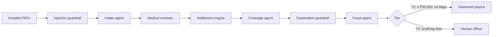

# ClaimGuard

**Governed, observable agentic AI for health-insurance reimbursement claims.**

AI agents read a policyholder's hospital bill and discharge summary, review the case,
calculate the payout and screen for fraud. Clean claims are paid in about a minute;
risky ones go to a human officer. Every action is policy-checked, every data access
uses a short-lived credential, and every decision is audited and traced.

> All data is synthetic: a fictional insurer (Kaveri Health Assurance), hospitals and people.

## The business problem

Reimbursement claims are read and calculated by hand. A simple claim takes 2–3 weeks,
two officers can settle it differently, and "why was this claim cut?" is hard to answer.
AI agents could do the work, but a claim combines the three hardest conditions for AI:
**medical data**, **irreversible money**, and **documents written by a possible fraudster**
(prompt injection). The business will automate only if agents see only the data they
need, can't move money outside strict rules, never reject a claim alone, leave a full
audit trail, and are tested continuously.

The full business case is the console's **Business problem** page (`/problem`).

## The solution



One **Agno Workflow** runs four **Agno agents** with deterministic steps around them.
Under every agent action:

```
AGT policy check → Ed25519 identity → 1-scope JWT (≤ 300 s) → data gateway (7 checks) → Postgres
                 → hash-chained audit entry + one redacted OpenTelemetry trace per claim
```

| | |
|---|---|
| **Agentic AI (Agno)** | 4 typed agents in one Workflow served by AgentOS; no LLM decides the order or the money |
| **Governance (Microsoft AGT)** | 16 rules checked before every tool call, fail closed; a governed claim state machine |
| **Least privilege (JWT RBAC)** | Each agent gets its own EdDSA token per collection, only when it needs data, expiring in seconds |
| **Guardrails** | Hidden instructions in PDFs are flagged (never auto-paid); every ₹ in the explanation is verified |
| **Human in the loop** | Big, flagged or excluded claims and every rejection go to an officer |
| **Payout kill switch** | Compliance can freeze automated payouts instantly; governed and audited |
| **Audit & observability** | Tamper-evident audit log; one Phoenix trace per claim with medical text redacted |
| **Evaluation (Harbor)** | 10 scenarios incl. attacks, plus a check of every live claim, scoring outcome *and* governance; no Docker |
| **Console (Next.js)** | Role-based sign-in, dashboard, business problem, architecture, Live Run with agents and backend log, officer, compliance. Every figure it shows is computed live (`GET /system/facts`, Harbor, the audit log), never typed in |

## Tech stack

Agno 3 · Microsoft Agent Governance Toolkit 4.1 · PyJWT (EdDSA) · FastAPI ·
Postgres 16 + pgvector (Supabase) · OpenTelemetry, OpenInference, Arize Phoenix ·
Harbor 0.23 · Next.js 16 (TypeScript, Tailwind) · Groq (Gemini or Claude by config) ·
`uv`, npm. Runs natively on Windows, macOS and Linux; **no Docker**.

## Quick start

Prerequisites: Python 3.12+ with [`uv`](https://docs.astral.sh/uv/), Node.js 20+,
Postgres 16 + pgvector, and an API key for Groq, Gemini or Anthropic.

```bash
cp .env.example .env                        # set DATABASE_URL and an LLM key
npm install
cd backend && uv sync && cd ..
cd frontend && npm install && cd ..
cd evals/harbor && uv sync && cd ../..
npm run seed                                # synthetic data (idempotent)
node -e "console.log('CONSOLE_SESSION_SECRET='+require('crypto').randomBytes(32).toString('base64url'))" > frontend/.env.local

npm run dev                                 # every service, one terminal
```

Open **http://localhost:3005** and pick a demo account on the sign-in page:

| Account | Password | Role |
|---|---|---|
| `admin@kaveri-health.example` | `Admin@2026` | Platform admin: everything (use this to present) |
| `arjun.mehta@kaveri-health.example` | `Officer@2026` | Claims officer |
| `divya.nair@kaveri-health.example` | `Comply@2026` | Compliance officer |
| `priya.raman@example.com` | `Priya@2026` | Policyholder |

Services: console `:3005`, AgentOS `:8000`, token service `:8100`, data gateway `:8200`,
officer API `:8400`, Phoenix `:6006`.

## Demo in 20 minutes

1. **Business problem** → **Architecture**: why, then how.
2. **Live Run → Jyoti**: agents at work, per-agent JWTs, ₹37,300 auto-paid, Harbor verifies the claim.
3. **Live Run → Rahul**: a poisoned PDF is flagged; the red-team replay is blocked by policy.
4. **Compliance**: freeze automated payouts; a clean claim goes to an officer (GOV-004).
5. **Review queue**: break-glass with a reason, then approve.
6. **Harbor panel**: run a scenario live; S01–S10 scoreboard. **Phoenix**: one trace per claim.

Keep the `npm run dev` terminal visible: it prints the same story from the backend.
Full script and likely questions: [`docs/demo-script.md`](docs/demo-script.md).

## Tests and evaluation

```bash
make test            # all backend tests: rules, tokens, gateway, guardrails, kill switch, audit chain, settlement
make test-security   # only the security suite
npm run eval         # Harbor S01–S10 against the running stack (or "Run all" in the console)
```

## Repository

```
backend/        agents/ (Agno agents, workflow, guardrails, settlement) · governance/ (AGT adapter, rules,
                audit) · auth/ (token service) · data_gateway/ · api/ (AgentOS, officer API) · observability/
evals/harbor/   S01–S10 tasks, adapter, verifier, no-Docker environment, per-claim checks
frontend/       Next.js console · proxy.ts (sign-in and role-based pages)
data/synthetic/ generators and sample PDFs (incl. poisoned)
docs/           product overview, architecture, security matrix, ADRs, demo script
```

## Documentation

- [`docs/PRODUCT.md`](docs/PRODUCT.md): the full product overview (brief vs built, every feature, all 16 rules, framework findings, evidence)
- [`docs/architecture.md`](docs/architecture.md): architecture and data flow
- [`docs/security-matrix.md`](docs/security-matrix.md): agent × collection × scope × lifetime
- [`docs/compliance-mapping.md`](docs/compliance-mapping.md): DPDP / IRDAI → controls → tests
- [`docs/adr/`](docs/adr/): 12 architecture decision records
- [`docs/demo-script.md`](docs/demo-script.md): presenter walkthrough

## Limitations

- The console sign-in is a local identity store; the backend APIs don't yet check user tokens (next: OIDC).
- Single-node, local deployment (next: containers, a secrets vault, WORM storage for the audit log).
- The token service mirrors OAuth token exchange but is custom (next: a standards-based authorization server).
