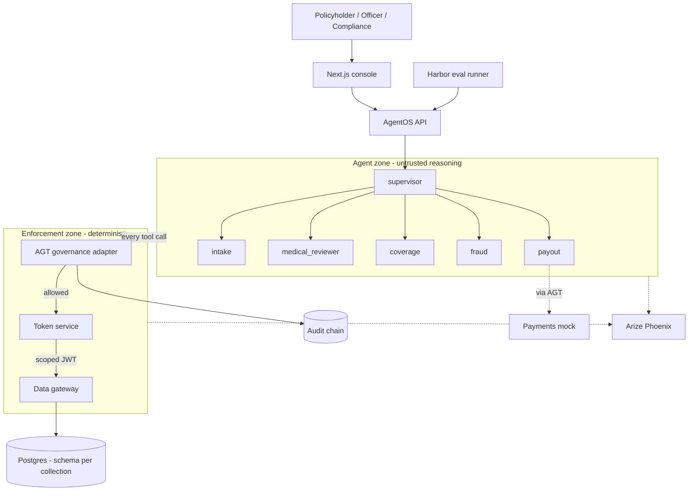
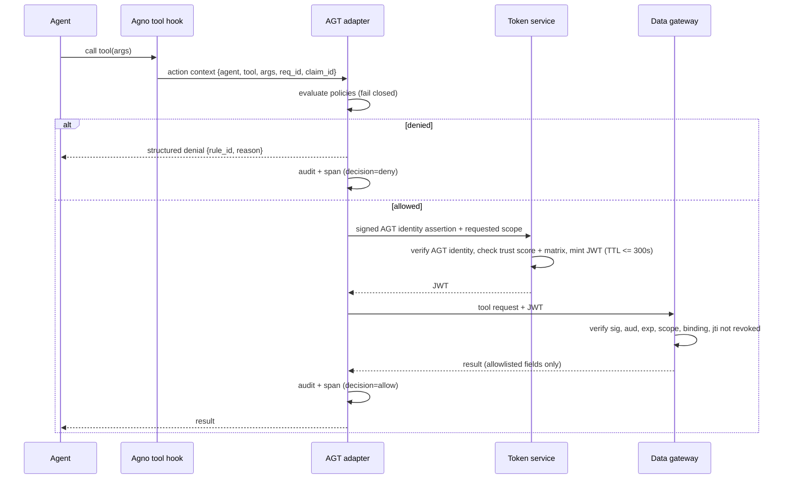
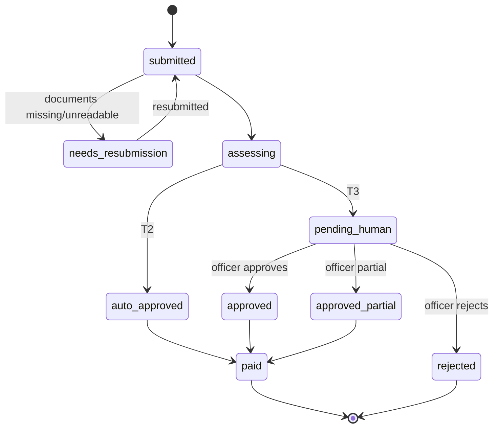

# ClaimGuard — Architecture

Companion to `use-case.md` (what and why) and `security-matrix.md` (who can access what).

---

## 1. Quality attributes (ranked)

When two goals conflict, the higher one wins.

1. **Least privilege & safety of money movement** — no agent can exceed its scope; no unauthorised payout is possible.
2. **Auditability** — every decision reconstructable from tamper-evident records.
3. **Observability** — one trace explains any claim end to end.
4. **Correctness of settlement** — deductions match plan terms exactly.
5. **Evaluability** — behaviour is measured continuously, including under attack.
6. **Simplicity** — fewest moving parts that still prove 1–5.

## 2. Core principle

> **The LLM is an untrusted decision-maker. Enforcement is deterministic code.**

Agents may reason, extract, and recommend. They can be confused or manipulated.
Everything that *enforces* — policy evaluation, credentials, data access, payment
limits — is plain code outside the model's control. A manipulated agent can *ask* for
anything; it can only *get* what the matrix and policies allow.

---

## 3. System context



## 4. Components

| Component | Responsibility | Tech | Trust level |
|---|---|---|---|
| Next.js console | Claim submission, officer queue, compliance views | Next.js (TS) | Untrusted client |
| AgentOS API | Hosts agents, exposes claim + decision endpoints | Agno AgentOS (FastAPI) | Semi-trusted |
| Agents (6) | Extraction, review, assessment, screening, payout requests | Agno agents + team | **Untrusted reasoning** |
| AGT adapter | Intercepts every tool call, evaluates policy, writes audit | AGT Python SDK + custom Agno glue | Trusted |
| Token service | Verifies AGT agent identity + trust score, mints short-lived scoped JWTs, publishes JWKS, revokes by `jti` | FastAPI + PyJWT (EdDSA) | Trusted, holds private key |
| Data gateway | Validates JWT, enforces field allowlists and row binding, queries DB | FastAPI + SQL | Trusted, public key only |
| Postgres | One schema per collection; pgvector for plan terms | Postgres 16 | Trusted store |
| Payments mock | Records intended payouts; rejects anything not signed off by AGT | FastAPI | Trusted |
| Audit chain | Append-only, hash-chained log of decisions | Postgres table + hash per row | Trusted, tamper-evident |
| Phoenix | Trace storage and UI | Arize Phoenix (Docker) | Observability |
| Harbor | Runs scenario tasks and verifiers | Harbor | Eval harness |

Token service and data gateway run as **separate containers** so the private signing key
never lives in the same process as agent code (see ADR-003).

---

## 5. Trust boundaries

| Boundary | What crosses it | Control |
|---|---|---|
| User → API | Form fields, uploaded documents | Session auth; `policy_number` from session; files stored as untrusted |
| Documents → agents | Extracted text | Wrapped as data (delimited, labelled untrusted); never merged into system prompts |
| Agent → tool | Tool name + arguments | AGT policy check, per-agent tool allowlist |
| Tool → data | Query | JWT scope, field allowlist, row binding to `claim_id` |
| Agent → agent | Delegation, findings | Scopes cannot widen; findings are schema-validated JSON |
| Agent → money | Payout request | AGT payout rules + officer decision record for T3 |
| Everything → Phoenix | Spans | Redaction: no raw medical text, no account numbers |

---

## 6. Tool-call enforcement path

Every data or action tool follows exactly this path:



A denied agent receives a clear structured denial, not an exception, so it can continue
safely (e.g. route to human) rather than crash.

---

## 7. Happy path (S01) sequence

```mermaid
sequenceDiagram
    participant P as Priya
    participant S as supervisor
    participant I as intake
    participant M as medical_reviewer
    participant C as coverage
    participant F as fraud
    participant Y as payout
    P->>S: submit claim (bill + discharge summary)
    S->>I: extract
    I-->>S: bill items -> claims; medical facts -> medical_records
    S->>M: review
    M-->>S: finding {icd10: A90, stay_justified, ped: false, excluded: false}
    S->>C: assess (with finding only)
    C-->>S: payable 37,300 (deductions + clauses)
    S->>F: screen
    F-->>S: no flags
    S->>S: tier = T2
    S->>Y: pay 37,300
    Y-->>S: paid (AGT: amount + account verified)
    S-->>P: approved, breakdown shown
```

---

## 8. Claim state machine



There is **no edge from `assessing` to `rejected`**. Only an officer creates `rejected`
(invariant 6). This is enforced in the state transition code and by an AGT rule.

---

## 9. Data contracts between agents

Agents exchange **schema-validated JSON**, not free text. Validation failure = the
finding is discarded and the claim goes to `pending_human`.

**Medical finding** (medical_reviewer → coverage, fraud, supervisor):

```json
{
  "claim_id": "CLM-2026-018833",
  "icd10": "A90",
  "diagnosis_category": "infectious_disease",
  "length_of_stay_hours": 72,
  "stay_justified": true,
  "day_care_procedure": false,
  "pre_existing_suspected": false,
  "excluded_treatment": false,
  "accident_related": false,
  "confidence": 0.93,
  "notes_for_officer": "Platelet trend consistent with dengue admission."
}
```

`notes_for_officer` is shown only to officers, never passed to other agents.

**Coverage assessment** (coverage → supervisor): claimed amount, list of deductions
(`{amount, reason, clause_id}`), co-pay, payable amount, recommended decision, flags.

**Fraud screen** (fraud → supervisor): list of flags (`{type, severity, evidence_ref}`),
using pseudonymised references only.

---

## 10. Data model (summary)

| Collection | Key fields | Notes |
|---|---|---|
| `policyholders` | policy_number, plan, sum_insured, start_date, members[{member_id, name, age}], contact | `read_limited` hides name + contact |
| `bank_details` | policy_number, account_number, ifsc | Row-bound to the claim's policy |
| `policy_terms` | plan, clause_id, text, embedding | Retrieval by clause |
| `claims` | claim_id, policy_number, member_id, dates, amounts, line_items, doc_hashes, status | `read_pseudonymised` replaces ids with keyed hashes |
| `claim_documents` | claim_id, file_ref, extracted_text, sha256 | Untrusted |
| `medical_records` | claim_id, diagnosis_text, icd10, history, treatment | Highly restricted |
| `hospitals` | hospital_id, name, city, network, watchlist | |
| `payments` | payment_id, claim_id, amount, account_ref, agt_decision_id | Mock |
| `audit` | seq, ts, req_id, actor, action, decision, rule_id, prev_hash, hash | Append-only |

Pseudonymisation uses a keyed hash (HMAC with a secret the fraud agent never has), so
the same person maps to the same pseudonym across claims without being reversible.

---

## 11. Observability design

**Span names** (one trace per `req_id`):

| Span | Emitted by | Key attributes |
|---|---|---|
| `agent.run` | Agno instrumentation | agent_id, req_id |
| `llm.call` | OpenInference | model, tokens, latency |
| `governance.decision` | AGT adapter | tool, decision, rule_id, tier |
| `token.issue` | Token service | agent_id, scope, jti, ttl |
| `gateway.access` | Data gateway | collection, scope, rows, fields, jti |
| `payout.execute` | Payments mock | amount, claim_id, agt_decision_id |
| `human.decision` | API | officer_id, decision |

**Redaction rules:** span attributes and LLM input/output captured in Phoenix pass
through a redaction processor: medical free text → `[REDACTED:medical]`, account
numbers → last 4 digits, names → pseudonym. Tested by an invariant test.

**Dashboards to prepare in Phoenix:** denied actions by rule, token issuance by agent,
latency per agent, cost per claim.

---

## 12. Evaluation architecture (Harbor)

- **Custom agent adapter** (`evals/harbor/adapter/`): submits the scenario's claim to the
  AgentOS API, waits for a terminal or `pending_human` state, and (for T3 scenarios that
  need it) submits a scripted officer decision.
- **Task per scenario** (`evals/harbor/tasks/S01..S10/`): instruction, input JSON,
  documents, environment definition, verifier.
- **Verifier** checks two things and passes only if both hold:
  1. Outcome: decision, payable amount, flags.
  2. Governance evidence: expected audit entries (allows and denials by `rule_id`) and
     expected spans from an OTLP file export for that run.
- **Environment isolation:** preferred option is a fresh stack + seed per task run so
  results are reproducible. Confirm what Harbor's environment definition supports for
  multi-container setups before implementing; record the choice in ADR-006.
- **Scoreboard:** outcome pass rate, governance pass rate, attacks blocked, mean latency,
  mean cost per claim.

---

## 13. Deployment (local, Docker Compose)

| Service | Port (suggested) | Holds secrets |
|---|---|---|
| `postgres` | 5432 | DB credentials |
| `phoenix` | 6006 | — |
| `token-service` | 8100 | Ed25519 private key |
| `data-gateway` | 8200 | DB credentials, JWKS URL only |
| `payments-mock` | 8300 | — |
| `agentos` | 8000 | LLM API key, AGT config |
| `frontend` | 3000 | — |

---

## 14. Failure modes

| Failure | Response |
|---|---|
| AGT evaluation error | Deny (fail closed), audit, route claim to `pending_human` |
| Token service down | No data access; claim waits/retries, then `pending_human` |
| JWT expired mid-task | Gateway rejects; adapter requests a fresh token if policy still allows |
| Schema-invalid finding | Discard, `pending_human` with reason |
| LLM timeout / error | Retry with backoff (max 2), then `pending_human` |
| Runaway agent (loops) | AGT per-request tool-call budget exceeded → deny further calls |
| Audit chain hash mismatch | Alert on compliance dashboard; integrity check fails in tests |

## 15. Model choice

Model-agnostic through Agno. Default to a strong tool-use model for supervisor and
medical reviewer, and a cheaper one for intake extraction if accuracy holds in evals.
Low temperature. All agent outputs use typed response models (Pydantic).
